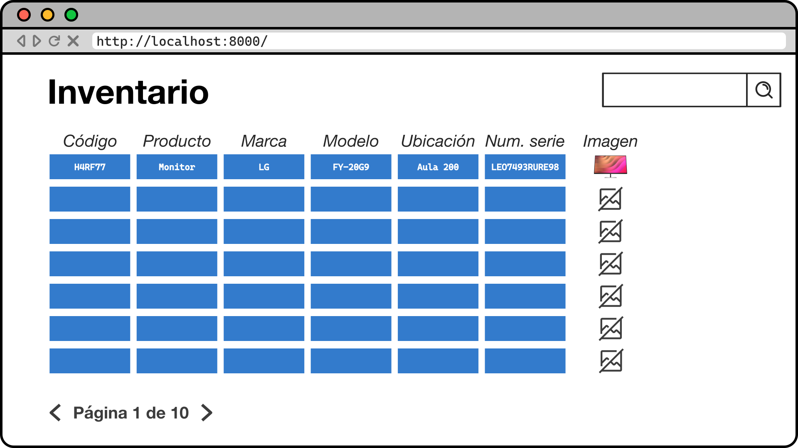

# Inventory

[Objetivo](#objetivo)  
[Estructura](#estructura)  
[Esquema de la base de datos](#esquema-de-la-base-de-datos)  
[Mockups del proyecto](#mockups-del-proyecto)  
[Interfaz administrativa](#interfaz-administrativa)  
[Aclaraciones](#aclaraciones)

## Objetivo

El objetivo de esta tarea es crear una aplicación para gestionar el **inventario tecnológico** de cualquier organización.

## Estructura

```
inventory
    inventory/
        ...
        settings.py
    stock/
        ...
        models.py
```

## Esquema de la base de datos


## Mockups del proyecto



> 💡 "Código" es el código del artículo.

## Interfaz administrativa

- Trata de trabajar lo máximo posible en la interfaz administrativa de manera que sea cómodo gestionar productos, artículos y ubicaciones ([CRUD](https://es.wikipedia.org/wiki/CRUD)).
- Para producto y artículo, si no se especifica un código al crear un nuevo objeto, este se deberá generar de manera aleatoria como un _string_ alfanumérico de longitud 6 (_obviamente no se puede repetir_).
- Utiliza [inlines](https://docs.djangoproject.com/en/5.0/ref/contrib/admin/#inlinemodeladmin-objects) sobre productos/artículos.

## Aclaraciones

- La búsqueda debería funcionar para todos los campos del artículo (incluyendo sus claves ajenas).